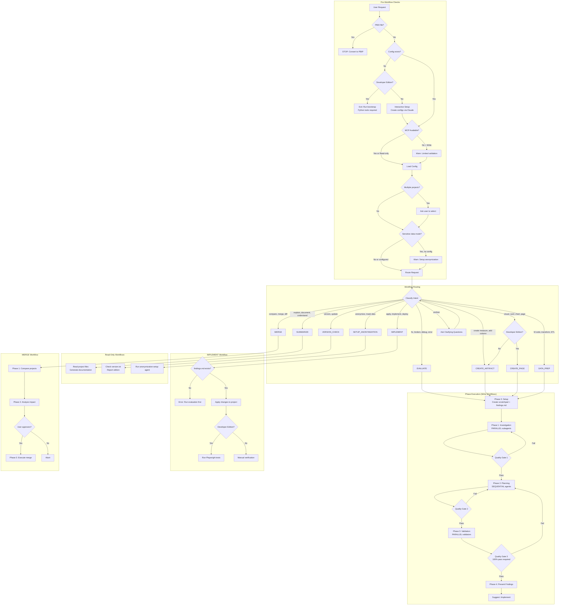
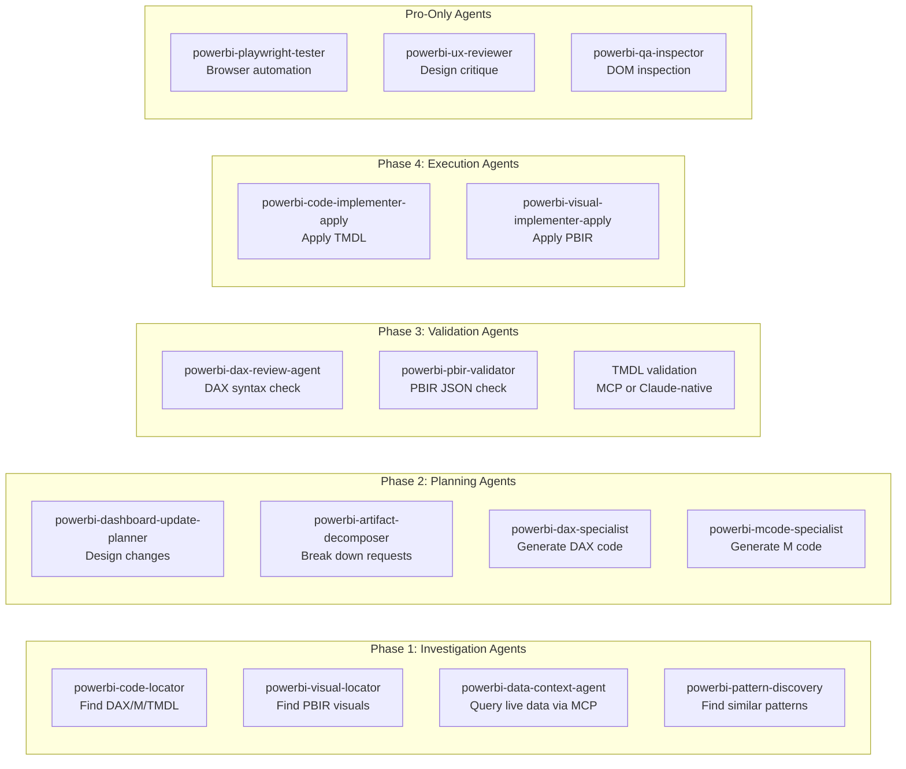

# PBI Squire Plugin - Workflow Mermaid Diagram

**Target location:** `project_documentation/workflow-diagrams.md`

---

## Mermaid Flowchart

Copy this into FigJam (it supports Mermaid) or any Mermaid renderer:

## Subagent Pool Diagram

## Trigger Keywords Reference

| Workflow | Trigger Keywords |
|----------|------------------|
| EVALUATE | fix, broken, wrong, debug, issue, error, not working |
| CREATE_ARTIFACT | create measure, add measure, new column, new table |
| CREATE_PAGE (Developer) | visual, card, chart, page, dashboard page, build visual |
| DATA_PREP | M code, Power Query, transform, ETL, filter table, merge tables |
| SUMMARIZE | explain, understand, what does, document, tell me about |
| IMPLEMENT | apply, implement, deploy, execute, make the changes |
| MERGE | compare, merge, diff, sync projects, combine |
| VERSION_CHECK | version, update, edition |
| SETUP_ANONYMIZATION | anonymize, mask sensitive, data masking, hide PII |

## Usage

1. **In FigJam**: Paste the Mermaid code into a code block - FigJam renders Mermaid natively
2. **In VS Code**: Use Mermaid Preview extension
3. **Online**: Use [mermaid.live](https://mermaid.live) to render and export as SVG/PNG
4. **In GitHub**: Mermaid renders automatically in markdown files

## Next Steps

If you want me to:
- Export this as an SVG file
- Add more detail to specific sections
- Create separate diagrams for individual workflows

Just let me know!
